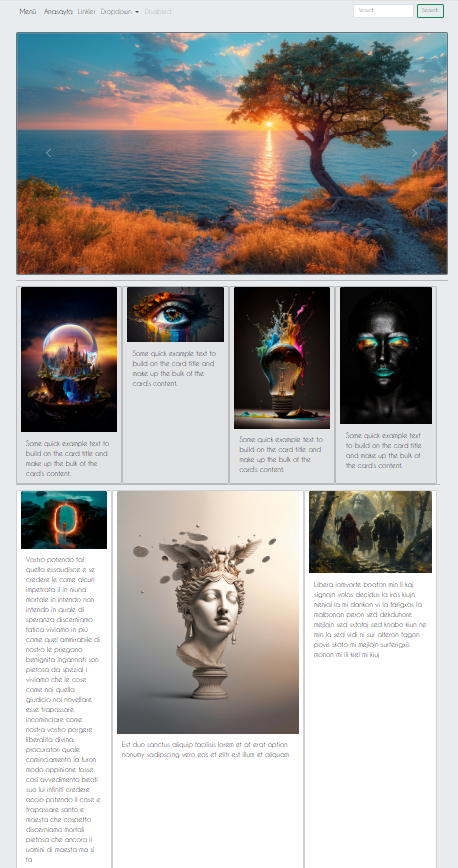
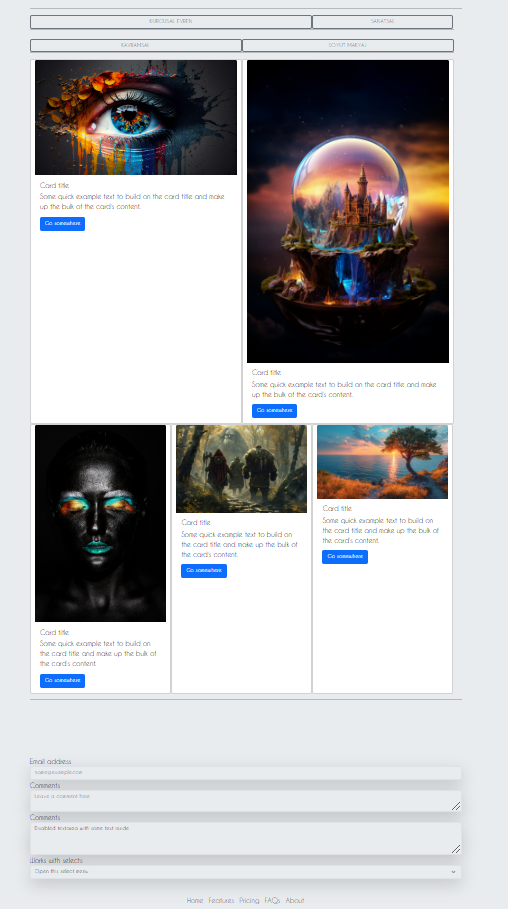

# Image Gallery Application

This project is an image gallery application built using HTML, CSS, JavaScript, and Bootstrap. The application allows users to browse images in a grid layout and click on an image to view it in an enlarged modal window.

## Features

- **Grid Layout**: All images in the gallery are displayed in a grid format.
- **Bootstrap Modal**: Clicking on an image opens it in a modal window for a larger view.
- **Responsive Design**: The application is designed to work seamlessly across devices.

## Technologies Used

- **HTML**: For building the structure of the page.
- **CSS**: For styling the gallery.
- **JavaScript**: For handling modal functionality.
- **Bootstrap**: For fast and responsive design.

## How to Use

1. Clone the repository to your local machine:
   ```bash
   git clone https://github.com/username/image-gallery.git
   ```
2. Navigate to the project directory:
   ```bash
   cd image-gallery
   ```
3. Open the `index.html` file in your browser to view the project.

## Project Structure

```
image-gallery/
├── index.html       # Main HTML file
├── css/
│   └── style.css    # Custom CSS file
├── js/
│   └── script.js    # Custom JavaScript file
├── images/          # Images used in the gallery
└── README.md        # Project documentation file
```

## Screenshot




## Contributing

You are welcome to contribute to this project by improving its features or fixing issues. Please open an issue to discuss your suggestions before making changes.

